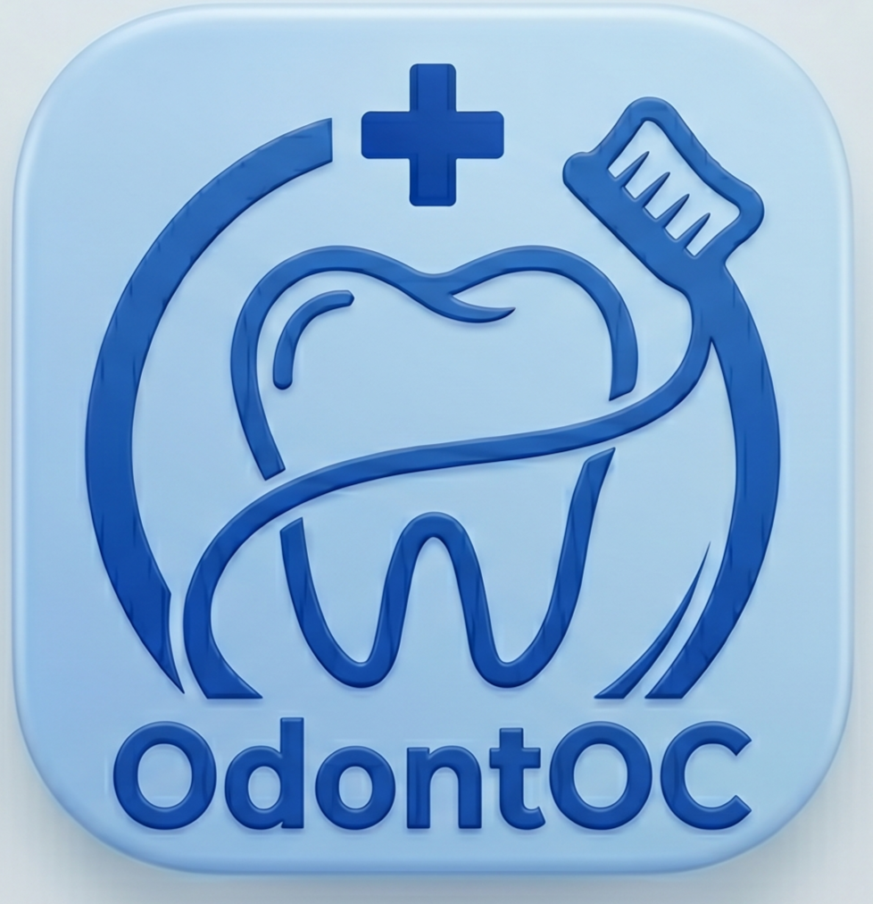

  
  
  # OdontOC - Gestão Odontológica Inteligente

  **Sistema completo para gestão de clínicas odontológicas, focado em agilidade clínica, controle financeiro e experiência do usuário.**

  
  
  
  
  

   

---

## 📥 Download e Instalação

Bem-vindo ao **OdontOC**! O sistema foi projetado para rodar localmente na sua máquina, garantindo segurança total dos seus dados, sem mensalidades na nuvem.

### 💿 Baixar o Instalador

Oferecemos duas versões do instalador para atender à sua necessidade:

#### 1. Versão Limpa (Recomendada para Produção)
Esta versão acompanha um banco de dados 100% limpo, sem pacientes ou transações de teste, pronta para o uso real e diário na sua clínica.
> **[✨ Baixar OdontOC (Versão Limpa) - v1.0.2 (Windows .exe)](https://github.com/Pedro-Carvalho-18/app_odontoCO/releases/download/OdontOC_V1.0.2/OdontOC_Distrib_Clean_v1.0.2.exe)**

**Como instalar:**
1. Baixe o arquivo `.exe` acima.
2. Dê um duplo clique e siga as instruções na tela.
3. Um atalho será criado na sua Área de Trabalho.
4. Abra o sistema e acesse a aba **Configurações > Meu Perfil** para inserir seus dados!

---

## 🔄 Atualizações (Updates)

Sempre estamos melhorando o OdontOC. Quando uma nova versão for lançada, você poderá baixá-la aqui.
**Fique tranquilo:** Ao instalar uma atualização, **seus pacientes, orçamentos e agenda NUNCA serão apagados.** O sistema possui um motor inteligente de *Migração de Dados* que atualiza a estrutura mantendo tudo intacto.

### Versões Disponíveis:
- 🔵 **v1.0.1 (Estável - Otimização 1080p & Melhorias Clínicas)** - *Ajustes de interface para alta resolução, melhorias no histórico e correção no receituário.* -> **[Baixar v1.0.1 (EXE)](dist/OdontOC_Distrib_Clean_v1.0.1.exe)**
- 🟢 **v1.0.0 (Lançamento Oficial)** - *Sistema completo de gestão, prontuário e financeiro.* -> **[Baixar v1.0.0](https://github.com/Pedro-Carvalho-18/app_odontoCO/releases/download/OdontOC_V1.0/OdontOC_v1.0.0.exe)**

**Como atualizar:**
1. Feche o aplicativo OdontOC caso esteja aberto.
2. Baixe o arquivo de Update acima (`OdontOC_Distrib_Clean_v1.0.1.exe`).
3. Instale normalmente (ele substituirá apenas o motor do sistema, mantendo seu banco de dados seguro).

---

## 🚀 Novidades da v1.0.1

- **Otimização para 1080p:** 
  - Desenho dos dentes e faces do odontograma ampliados para melhor visibilidade em monitores Full HD.
  - Campos do modal de "Novo Lançamento" maiores e com melhor espaçamento.
  - Aumento geral das fontes em movimentações, extratos e históricos para facilitar a leitura.
- **Melhorias no Histórico Clínico:** 
  - Agora o número do dente ou região é exibido automaticamente ao lado de cada procedimento na linha do tempo do paciente.
  - Nome do paciente selecionado no cabeçalho do odontograma está mais proeminente.
- **Receituário Inteligente:** 
  - Correção na gravação de receitas (agora salva o nome do remédio, quantidade, modo de uso e observações).
  - Visual reformulado: remoção de prefixos redundantes (`PROCEDIMENTO:`) e destaque azul em itálico para os medicamentos.
  - Correção do erro que gerava lançamentos duplicados no prontuário ao emitir receitas.
- **Estabilidade:** Correção do erro "getSpecialtyIcon is not defined".

---

## ✨ Principais Funcionalidades

### 🦷 Prontuário Clínico & Odontograma
- **Odontograma Interativo:** Clique nos dentes para marcar cáries, restaurações, extrações, etc.
- **Salvamento Automático (Auto-save):** As alterações no odontograma são sincronizadas com o banco de dados em tempo real, sem precisar clicar em "Salvar".
- **Histórico Fiel:** Linha do tempo completa de todas as intervenções realizadas, filtrando automaticamente edições do odontograma para manter a tela limpa.

### 💰 Gestão Financeira e Orçamentos
- **Lançamento Rápido:** Selecione procedimentos categorizados por especialidade (Endodontia, Ortodontia, etc.).
- **Orçamentos Flexíveis:** Aplique descontos, defina o número de parcelas e selecione a forma de pagamento (Pix, Cartão, Dinheiro).
- **Controle de Parcelas:** Acompanhe exatamente quantas parcelas foram pagas e o Saldo Devedor do paciente na aba de Prontuário.
- **Extrato Financeiro:** Gere relatórios em formato Excel (CSV) filtrando por mês, tipo de transação (Entrada/Saída) e busca por nome.

### 📅 Agenda Inteligente
- **Controle Semanal:** Visualização clara da semana de segunda a sábado.
- **Integração com Pacientes:** Agende diretamente pelo perfil do paciente ou pesquise no momento do agendamento.
- **Calendário Rápido:** Selecione rapidamente a data usando o seletor integrado no cabeçalho.

### 📝 Receituário Automático
- Assistente prático para criar receitas médicas.
- Busca rápida no catálogo de medicamentos.
- Geração de texto formatado com opção de edição livre e impressão.

### ⚙️ Configurações e Banco de Dados
- **Perfil do Profissional:** Personalize Nome, CRO, Especialidades e Contatos (reflete na barra lateral).
- **Dados da Clínica:** Configure as informações que aparecerão no cabeçalho das suas receitas.
- **Gerenciador de Banco de Dados:** Adicione novos medicamentos, crie novos procedimentos no catálogo ou cadastre novos dentistas diretamente pelo sistema.
- **Painel de Suporte:** Exporte um backup do seu banco de dados com apenas um clique caso precise de suporte técnico.

---

## 💻 Tecnologias

O OdontOC foi construído com as tecnologias mais modernas e eficientes do mercado web, empacotadas para desktop:

- **Next.js 16 & React 19:** Renderização super rápida e componentes dinâmicos.
- **Tailwind CSS:** Design de interface moderno, limpo e responsivo.
- **SQLite 3:** Banco de dados relacional embutido (local), garantindo respostas em milissegundos sem depender de internet.
- **Lucide Icons:** Iconografia elegante e profissional.

---

## 🛠 Suporte Técnico

Encontrou um erro ou tem uma sugestão de melhoria? 
Dentro do sistema, vá em **Configurações > Banco de Dados > Informações de Suporte** e exporte seu banco de dados se solicitado pela equipe técnica.

---

  <i>Desenvolvido com dedicação para facilitar o dia a dia do cirurgião-dentista. © 2026</i>

